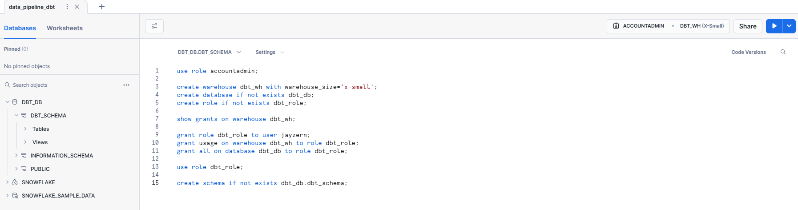
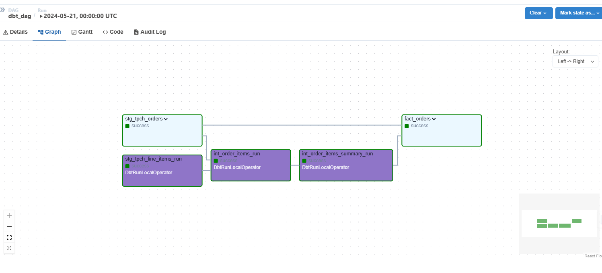

# Building an ELT Pipeline with dbt, Snowflake, and Airflow

## Project Overview

This project demonstrates how to build an ELT pipeline using dbt, Snowflake, and Airflow. 
Follow the steps below to set up your environment, configure dbt, create models, macros, tests, and deploy on Airflow.

## Steps

### Step 1: Setup Snowflake Environment

1. **Create Accounts and Roles**

```
use role accountadmin;

create warehouse dbt_wh with warehouse_size='x-small';
create database if not exists dbt_db;
create role if not exists dbt_role;

show grants on warehouse dbt_wh;

grant role dbt_role to user <USER_NAME>;
grant usage on warehouse dbt_wh to role dbt_role;
grant all on database dbt_db to role dbt_role;

use role dbt_role;

create schema if not exists dbt_db.dbt_schema;

```
## Snowflake Warehouse, Database, Schema  Deployment


#### Clean Up

```
use role accountadmin;

drop warehouse if exists dbt_wh;
drop database if exists dbt_db;
drop role if exists dbt_role;
```

### Step 2: Configure dbt Profile
#### Update dbt_profile.yaml:

```
models:
  snowflake_workshop:
    staging:
      materialized: view
      snowflake_warehouse: dbt_wh
    marts:
      materialized: table
      snowflake_warehouse: dbt_wh
  ```
### Step 3: Create Source and Staging Files
#### Create models/staging/tpch_sources.yml:


```
version: 2

sources:
  - name: tpch
    database: snowflake_sample_data
    schema: tpch_sf1
    tables:
      - name: orders
        columns:
          - name: o_orderkey
            tests:
              - unique
              - not_null
      - name: lineitem
        columns:
          - name: l_orderkey
            tests:
              - relationships:
                  to: source('tpch', 'orders')
                  field: o_orderkey
```
#### Create models/staging/stg_tpch_orders.sql:

```select
    o_orderkey as order_key,
    o_custkey as customer_key,
    o_orderstatus as status_code,
    o_totalprice as total_price,
    o_orderdate as order_date
from
    {{ source('tpch', 'orders') }}

```
#### Create models/staging/tpch/stg_tpch_line_items.sql:
```
select
    {{
        dbt_utils.generate_surrogate_key([
            'l_orderkey',
            'l_linenumber'
        ])
    }} as order_item_key,
	l_orderkey as order_key,
	l_partkey as part_key,
	l_linenumber as line_number,
	l_quantity as quantity,
	l_extendedprice as extended_price,
	l_discount as discount_percentage,
	l_tax as tax_rate
from
    {{ source('tpch', 'lineitem') }}
```

### Step 4: Macros (D.R.Y.)
#### Create macros/pricing.sql:

```

    (-1 * {{ extended_price }} * {{ discount_percentage }})::decimal(16, {{ scale }})

```

### Step 5: Transform Models (Fact Tables, Data Marts)
#### Create Intermediate Table models/marts/int_order_items.sql:


```
select
    line_item.order_item_key,
    line_item.part_key,
    line_item.line_number,
    line_item.extended_price,
    orders.order_key,
    orders.customer_key,
    orders.order_date,
    {{ discounted_amount('line_item.extended_price', 'line_item.discount_percentage') }} as item_discount_amount
from
    {{ ref('stg_tpch_orders') }} as orders
join
    {{ ref('stg_tpch_line_items') }} as line_item
        on orders.order_key = line_item.order_key
order by
    orders.order_date
```

#### Create Aggregation Table models/marts/int_order_items_summary.sql:

```
select 
    order_key,
    sum(extended_price) as gross_item_sales_amount,
    sum(item_discount_amount) as item_discount_amount
from
    {{ ref('int_order_items') }}
group by
    order_key
```

#### Create Fact Model models/marts/fct_orders.sql:

```
select
    orders.*,
    order_item_summary.gross_item_sales_amount,
    order_item_summary.item_discount_amount
from
    {{ ref('stg_tpch_orders') }} as orders
join
    {{ ref('int_order_items_summary') }} as order_item_summary
        on orders.order_key = order_item_summary.order_key
order by order_date
```
### Step 6: Generic and Singular Tests
#### Create models/marts/generic_tests.yml:

```
models:
  - name: fct_orders
    columns:
      - name: order_key
        tests:
          - unique
          - not_null
          - relationships:
              to: ref('stg_tpch_orders')
              field: order_key
              severity: warn
      - name: status_code
        tests:
          - accepted_values:
              values: ['P', 'O', 'F']
```

#### Build Singular Tests tests/fct_orders_discount.sql:

```select
    *
from
    {{ ref('fct_orders') }}
where
    item_discount_amount > 0
```

#### Create tests/fct_orders_date_valid.sql:

```
select
    *
from
    {{ ref('fct_orders') }}
where
    date(order_date) > CURRENT_DATE()
    or date(order_date) < date('1990-01-01')
```

### Step 7: Deploy on Airflow
#### Update Dockerfile


```RUN python -m venv dbt_venv && source dbt_venv/bin/activate && \
    pip install --no-cache-dir dbt-snowflake && deactivate
```

#### Update requirements.txt

```astronomer-cosmos
apache-airflow-providers-snowflake
```

#### Add Snowflake Connection in Airflow UI

```{
  "account": "<account_locator>-<account_name>",
  "warehouse": "dbt_wh",
  "database": "dbt_db",
  "role": "dbt_role",
  "insecure_mode": false
}
```

#### Create dbt_dag.py

```import os
from datetime import datetime

from cosmos import DbtDag, ProjectConfig, ProfileConfig, ExecutionConfig
from cosmos.profiles import SnowflakeUserPasswordProfileMapping

profile_config = ProfileConfig(
    profile_name="default",
    target_name="dev",
    profile
```

## Successful deployment in Airflow

